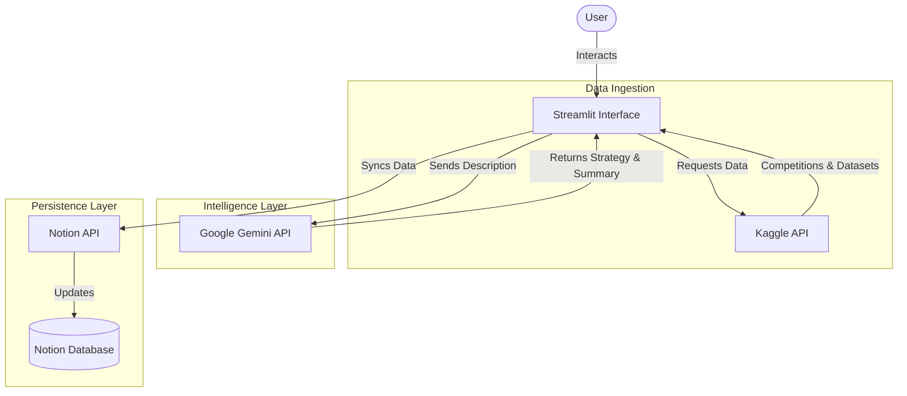

# **⚡ KaggleN**

**Bridge the gap between Data Science competitions and productivity.**
> *Manage Kaggle competitions, get AI-powered insights, and sync everything to Notion.*

## **📖 About The Project**

**KaggleN** is a powerful productivity tool designed for data scientists and Kaggle competitors. It integrates your **Kaggle** workspace with your **Notion** dashboard, supercharged by **Google's Gemini** models.

Keeping track of active competitions, analyzing datasets, and maintaining a study log can be overwhelming. KaggleN solves this by:

1. **Fetching** your live competition data directly from Kaggle.  
2. **Analyzing** competition descriptions using Gemini to give you summaries and strategic starting points.  
3. **Syncing** this organized data into a Notion database for long-term tracking and project management.

## **🏗️ Architectural Structure**

The application follows a modular architecture orchestrated by Streamlit.



### **Technical Implementation**

_*_ **Frontend**: Built with **Streamlit**  for a responsive, Python-centric web interface.  
_*_ **Kaggle Integration**: Uses the official Kaggle Python library to authenticate and fetch competition lists, leaderboards, and dataset metadata.  
_*_ **AI Engine**: Integrates Google Generative AI to access Gemini. It processes raw competition text to generate concise summaries, "Plan of Attack" strategies, and key evaluation metrics.  
_*_ **Productivity Sync**: Utilizes notion-client to map Python objects to Notion blocks and properties, allowing users to create pages and databases dynamically.

## **✨ Key Features**

* **🔐 Seamless Authentication**: Securely connect Kaggle and Notion accounts using API tokens.  
* **📊 Live Competition Feed**: View active competitions, prize pools, and deadlines in real-time.  
* **🤖 AI Insights**: Get instant summaries and suggested approaches for competitions generated by Gemini.  
* **📝 One-Click Sync**: Push competition details (Name, URL, Deadline, Description) directly to a Notion database.  
* **📂 Dataset Explorer**: Search and view Kaggle datasets without leaving the app.

## **🚀 Getting Started**

Follow these steps to get a local copy up and running.

### **Prerequisites**

You will need API keys for the services used:

1. **Kaggle API Token**: Go to your Kaggle Account \-\> Create New API Token. 
2. **Notion Integration Token**:  
   * Go to [Notion My Integrations](https://www.notion.so/my-integrations).  
   * Create a new integration (Internal).  
   * **Important**: Share your target Database with this integration (Click ... on the Notion Page \-\> Connections \-\> Add your integration).  
3. **Google Gemini API Key**: Get your key from [Google AI Studio](https://makersuite.google.com/app/apikey).

### **Installation**

1. **Clone the repository** (ensure you check the luxray branch):  
    ```bash
   git clone -b luxray https://github.com/MYTE21/KaggleN.git

   cd KaggleN
    ```
2. **Install dependencies**:  
   ```bash
   pip install -r requirements.txt
   ```

3. **Environment Setup**: 
   * Create a `.env` file and input keys.

### **Running the App**
```bash
streamlit run app.py
```

## **📄 License**

Distributed under the MIT License. See LICENSE for more information.
